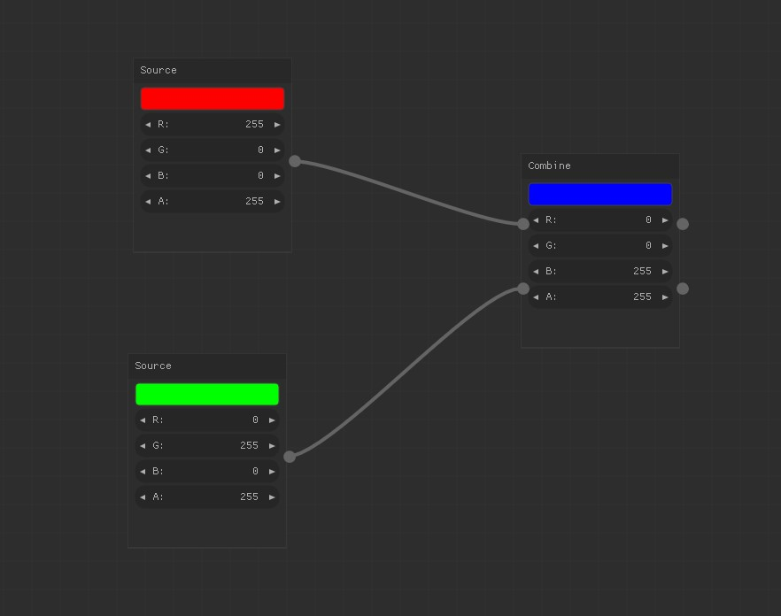

# Node editor

Node editor UX exploration using Nuklear GUI lib - based on nodes example.

## Dependencies

- SDL2
- glew
- cglm
- dirent_win

## Init project

### GLEW

Go into `auto` folder and do `make`. After that solution from `glew\build\vc15`
should build fine.
